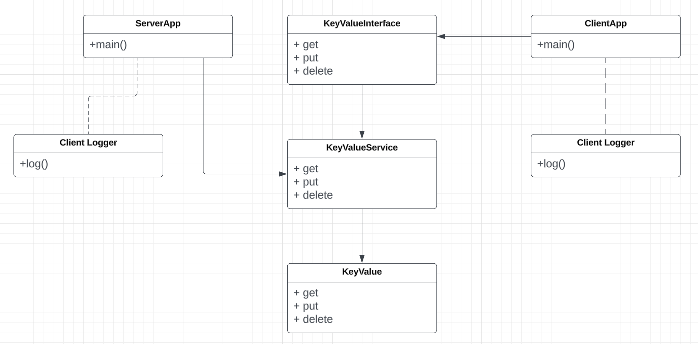

## Excutive Summary:

### 1. Assignment Overview:
This project was aimed at transitioning from a traditional TCP/UDP-based communication model to a more sophisticated Remote Procedure Call (RPC) framework utilizing Java RMI (Remote Method Invocation). The goal was to reimagine the key-value data store application, previously reliant on socket programming, into an architecture that leverages the Java RMI framework for network communications. This transition allowed for a deeper exploration of RPC mechanisms, offering insights into seamless, location-transparent method invocations that are crucial for distributed systems. The assignment tasked us with building a client-server model capable of executing PUT, GET, and DELETE operations on a data store, with the additional complexity of handling these operations concurrently across multiple client instances. The emphasis on Java RMI provided a valuable perspective on implementing distributed applications, highlighting the importance of interface-driven design, object serialization, and remote object lifecycle management. Furthermore, the requirement to incorporate multi-threading and mutual exclusion introduced practical challenges related to concurrency control, synchronization, and ensuring data consistency in a distributed environment.

### 2. Technical Impression:
Embarking on the development of an RMI-based key-value store presented a unique set of challenges, particularly in adapting to Java RMI's abstraction of network details and the paradigm shift from direct socket management to remote object invocation. My approach involved designing a system that not only facilitated remote method calls but also ensured thread safety and data consistency through the use of ConcurrentHashMap for state management and careful synchronization. This project illuminated the stark differences between RPC and socket-based communication, especially the ease with which RMI allows for invoking methods on remote objects as if they were local.

One significant aspect of this project was grappling with the concurrency model necessitated by RMI's inherently multi-threaded nature. Implementing a thread pool to manage server-side request processing effectively demonstrated the nuances of concurrent programming, from managing resource contention to ensuring deadlock avoidance. This aspect of the project underscored the criticality of designing for scalability and reliability in distributed systems.

Adopting RMI also highlighted the crucial role of interfaces in distributed object communication, underscoring the importance of clear, well-defined contracts between clients and servers. Moreover, the project was an excellent primer on the subtleties of Java's serialization mechanism, essential for RMI's under-the-hood operation but fraught with considerations around object compatibility and security. This was particularly useful for me as I am very new to Java.

The introduction of mutual exclusion mechanisms to safeguard against concurrent access issues was particularly enlightening. It showcased the importance of synchronization in preserving data integrity and consistency across distributed systems. This project served as a comprehensive exploration of RMI, from the basics of setting up remote object registries to the complexities of ensuring robust, thread-safe communication across distributed components.

### 3. Use Case / Application:

One example of a real use case of an RPC-based system is for a facilitate real-time patient monitoring and data analysis in clinical trials. This system would enable seamless communication between various distributed components, such as data collection devices (wearables, medical instruments), data processing services, and analytical dashboards.

Leveraging RPC for real-time patient monitoring and data analysis in clinical trials can significantly enhance the efficiency, reliability, and scalability of trial data management systems. By facilitating seamless and secure communication between distributed components, RPC-based systems can accelerate the pace of clinical trials, ensuring faster time-to-market for critical healthcare innovations.
