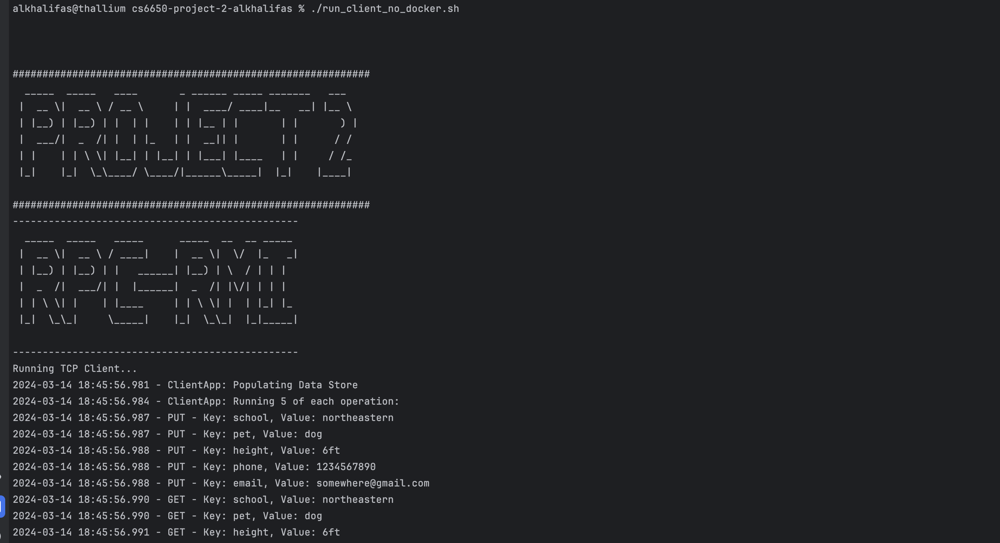
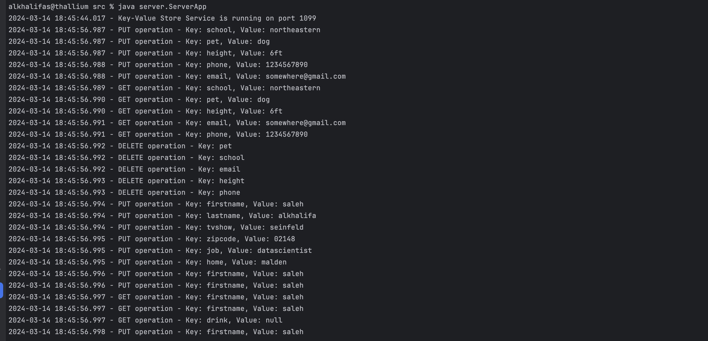
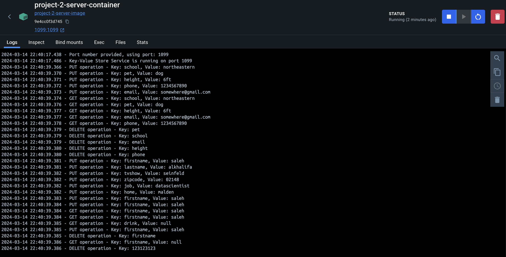
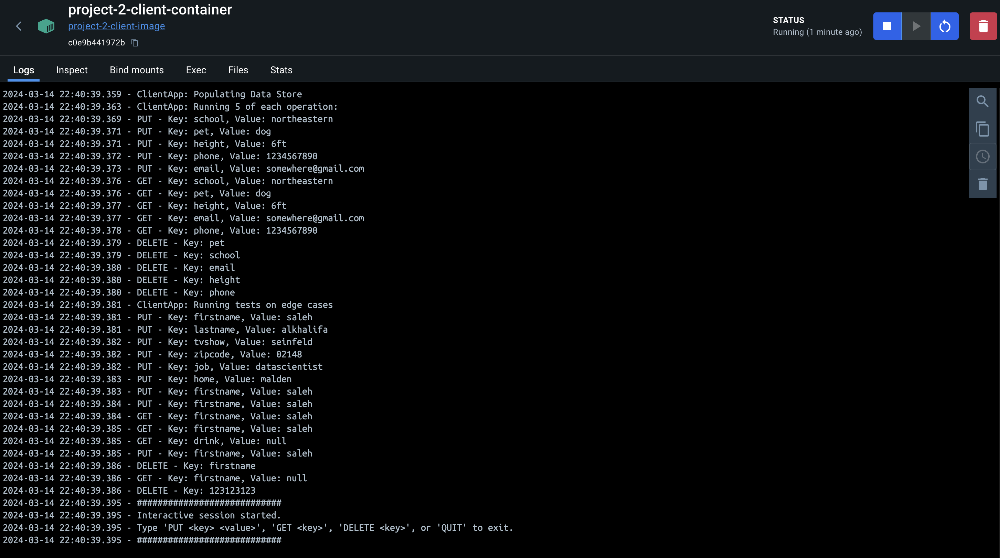

# Multi-threaded Key-Value Store using RPC
### CS 6650 Northeastern University
### Spring 2024

### Project 2 New Requirements:
- [x] You need to enable your client and server to communicate using Remote Procedure Calls (RPC) instead of sockets
- [x] If you’ve implemented Project #1 in Java, you may want to look into and leverage Java RMI for RPC communication
- [x] You need to make your server multi-threaded such that you can handle multiple outstanding client requests at once.
- [x] The key result is that your servers should be able to handle requests from multiple running instances of you client doing concurrent PUT, GET, and DELETE operations.
- [x] Due to the addition of multi-threading, you will need to handle mutual exclusion.

### Project 1 Remaining Requirements:
- [x] Make the client interactive
- [x] Docker is optional, but not required
- [x] Follow directory structure from guidelines
- [x] Create a run_client.sh file
- [x] Your implementation may be written in Java
- [x] Your source code should be well-factored and well-commented.
- [x] The client must take the following command line arguments hostname/IP and Port and protocol
- [x] if it does not receive a response to a particular request, you should note it in a client log and send the remaining requests
- [x] You will have to design a simple protocol to communicate packet contents
- [x] Three request types along with data passed along as part of the requests
- [x] The client must be robust to malformed or unrequested datagram packets
- [x] If it receives such a datagram packet, it should report it in a human-readable way
- [x] Every line the client prints to the client log should be time-stamped with the current system time
- [x] You may format the time any way you like as long as your output maintains millisecond precision
- [x] The server should run forever (until forcibly killed by an external signal, such as a Control-C
- [x] The server must display the requests received, and its responses, both in a human readable
- [x] The server must be robust to malformed datagram packets
- [x] If it receives a malformed datagram packet, it should report it in a human-readable way (length + address:port)
- [x] Every line the server prints to standard output or standard error must be time-stamped with the current system time (i.e., System.currentTimeMillis()).
- [x] You may format the time any way you like as long as your output maintains millisecond precision
- [x] You should use your client to pre-populate the Key-Value store with data and a set of keys.
- [x] Once the key-value store is populated, your client must do at least five of each operation: 5 PUTs, 5 GETs, 5 DELETEs.
- [x] Create an executive summary comprising “Assignment overview”, “technical impression”, and three use cases to apply this in practice.
- [x] “Assignment overview” (1 paragraph, up to about 250 words) explaining what you understand to be the purpose and scope of the assignment
- [x] “technical impression” (1–2 paragraphs, about 200–500 words) describing your experiences while carrying out the assignment.
- [x] Provide a use case (application) 3 where you would apply this in practice.
- [x] Attach screenshots of your testing done on your local environment.

### Instructions:

There are three methods to run the code for your convenience.

#### 1. Quick Start:

Compile the Java code:

    cd src
    javac server/*.java client/*.java

Run the Server:

    cd src
    java server.ServerApp

Run the Client:

    cd src
    java client.ClientApp localhost 1099

#### 2. Quick Start Scripts (No Docker):

Alternatively, you can run the .sh files instead:

    chmod +x run_server_no_docker.sh
    ./run_server_no_docker.sh

    chmod +x run_client_no_docker.sh
    ./run_client_no_docker.sh

#### 3. Quick Start Scripts (With Docker):

    cd src
    sudo ./deploy.sh
    sudo docker build -t project-2-client-image --target client-build .

    sudo ./run_client.sh project-2-client-container 1099

### Screen Shots:

Starting the Client:

Starting the Server:

Client Logs:

Server Logs:

Docker Containers:

Docker Server Logs:

Docker Client Logs:
